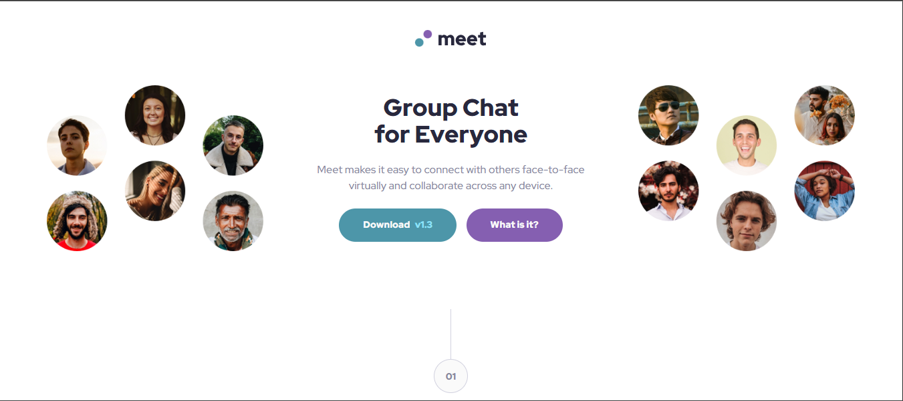

# Meet Landing Page

Landing page desenvolvida para um site de videoconferências moderno e responsivo.

## 🧠 Tecnologias utilizadas
- HTML  
- CSS  

## 🚀 Funcionalidades
- Layout totalmente responsivo  
- Design limpo e estruturado  
- Interface inspirada em ambientes de reuniões online  

## 🧩 Aprendizados
Durante o desenvolvimento, foram praticados conceitos como:
- Flexbox  
- Display e container  
- Organização e estruturação de layout  

## 🔧 Melhorias futuras
Pretendo expandir o projeto para algo mais profissional, adicionando novas funcionalidades e animações interativas.

## 🌐 Demonstração
[Acessar o site aqui](https://arthurrobertoalves.github.io/meet-landing-page)

## 🖼️ Captura de tela

## 👨‍💻 Autor
**Arthur Roberto Alves**  
[GitHub](https://github.com/arthurrobertoalves)

---

Projeto criado para praticar HTML e CSS, com foco em responsividade e construção de layouts modernos.
